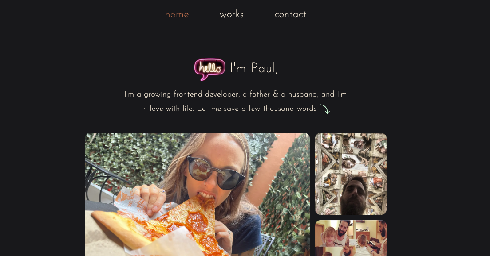

# Portfolio

### Preview:

### Things I learned:
  - Customizing the `tailwind.config` file
  - Importing fonts into NextJS using their font optimization
  - Using the `<Image />` componenent from NextJS and learning it's bugs
  - How to make Tailwind Intellisense work with the space bar
  - How to make a scrollable box of content
  - NextJS app routing... wow that's easy
  - How to edit SVG fills
  - Deploying with `Vercel` vs `Netlify`
  - Lots about merging/fetching/pushing etc from GitHub 

---

### Challenges I faced while building this:
  1. I finished the entire project and then deleted it by accident, including the repo itself.
  2. Learning `NextJS v13.4` was not intuitive to me at all
  3. Setting up a font in the `layout.tsx` file
  4. Understanding how to properly set up the `tailwind.config`
  5. Fixing things that aren't broken in the dev tools but are broken on live site
  6. Learning about issues post deployment caused by frameworks
  7. Figuring out why my `git push` wasn't git push-ing

---

### Tech I used:

---

### Things I'm proud of:
  - I recreated the site from scratch in one day after accidentally deleting it
  - All but mastering the tailwind framework
  - I didn't let the things I couldn't figure out, right away, make me discouraged
  - I completed this in a very reasonable amount of time, even taking time to make multiple drafts
  - I feel like this will represent me well without being too stiff
  - My family getting to be on something I've built
